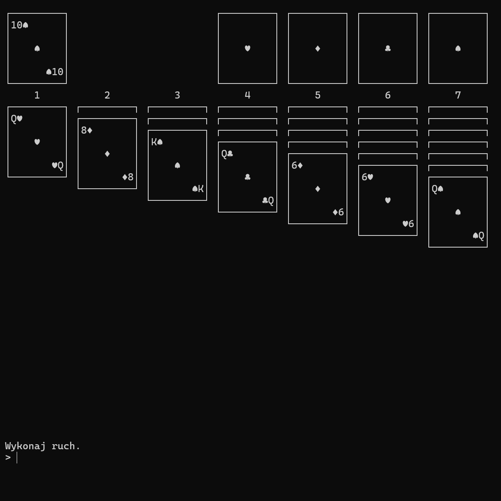
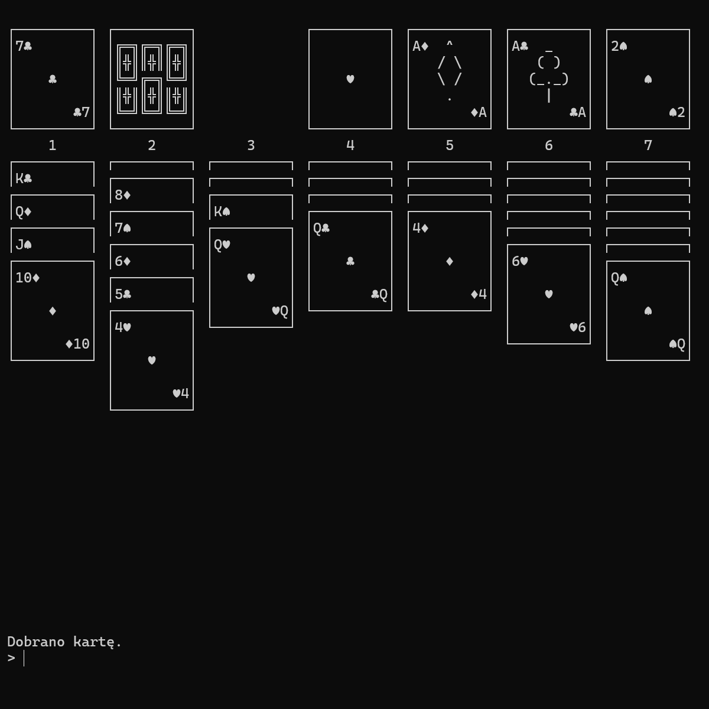

# Pasjans

Działająca w konsoli gra w pasjansa. Projekt został stworzony w języku C# z wykorzystaniem .NET Framework.

|||
|-|-|

### Sposób uruchomienia projektu:

Należy otworzyć plik Pasjans.exe w /Pasjans/bin/Release/Pasjans.exe.
Projekt działa na systemach Windows 10 i 11, nie działa na starszych systemach.

### Instrukcje rozgrywki:

Grą steruje się za pomocą poleceń tekstowych przekazywanych w wierszu poleceń u dołu ekranu.
Dostępne możliwości:

#### Przesuwanie kart

Aby przesunąć karty, nie trzeba podawać żadnych słów kluczowych jako że jest to najczęściej wykonywane działanie.
Należy podać najpierw skąd bierzemy karty, a po spacji dokąd je przekładamy.
Jeśli przekładamy ze zwykłego stosu na inny zwykły stos to możemy również na początku dać ilość kart do przeniesienia na raz, jeśli tego nie zrobimy to przyjmujemy że przekładamy jedną kartę. Jeśli chcemy przesunąć wszystkie odsłonięte karty to nie musimy podawać ilości.
Do zwykłych stosów odnosimy się numerami 1-7, do stosu z którego się dobiera d a do stosów końcowych e1-e4.
Przykłady:
1 3 - przeniesienie jednej karty ze stosu 1 na stos 3
2 4 6 - przeniesienie dwóch kart ze stosu 4 na stos 6
3 7 - przeniesienie wszystkich odsłoniętych kart ze stosu 3 na stos 7 (jeśli możliwe)
d 5 - przeniesienie karty ze stosu do dobierania na stos 5
7 e3 - przeniesienie karty ze stosu 7 na stos końcowy 3
e1 2 - przeniesienie karty ze stosu końcowego 1 na stos 2

#### Pobieranie kard

Aby odłożyć obecną wierzchnią kartę ze stosu do dobierania na bok by odłonić tą pod spodem używamy polecenia draw lub dobierz (skrót d).
Przykłady:
d
draw
dobierz

#### Resetowanie gry

Aby rozpocząć grę od nowa należy użyć polecenia restart (skrót r).
Przykłady:
r
restart

#### Wychodzenie z gry

Aby zamknąć grę należy użyć polecenia exit (skrót e) bądź wyjscie (skrót w).
Przykłady:
e
exit
w
wyjscie

#### Uzyskiwanie pomocy

Aby otworzyć ten plik z poziomu gry należy użyć polecenia help (skrót h) lub pomoc (skrót p).
Przykłady:
h
help
p
pomoc

Po wygranej należy wcisnąć jakikolwiek przycisk aby zacząć od nowa.

### Działanie programu

Kod jest cały skomentowany w środku, jednak zamieszczam także tu ogólny opis działania programu:

Wszystkie klasy stosów, czyli PlayStack, DrawStack i TopStack dziedziczą z klasy bazowej Stack. Zawiera ona podstawowe właściwości stosów a poszczególne klasy posiadają wyspecjalizowane właściwości.

W programie mamy 7 stosów zwykłych PlayStack przechowywanych w tablicy stacks\[], stos do dobierania DrawStack w drawStack i 4 stosy końcowe TopStack w topStacks\[].

Na początku programu wywołujemy funkcję Reset() która przygotowuje wszystko pod rozgrywkę.

Następnie zaczyna się powtarzać pętla gry. W pętli na początku rysujemy wszystko w konsoli funkcją Draw(), która pobiera od stosów odpowiednie dane i wypisuje wszystko co potrzebne w konsoli. Po tym pobieramy dane z wiersza poleceń od użytkownika i wykonujemy odpowiednie czynności, takie jak wywołanie odpowiednich funkcji lub wykonanie jakiegoś działania. Przygotowujemy informacje które zostaną przy następnej iteracji pętli wyświetlone w konsoli.

Pętla powtarza się aż do zakończenia programu.

